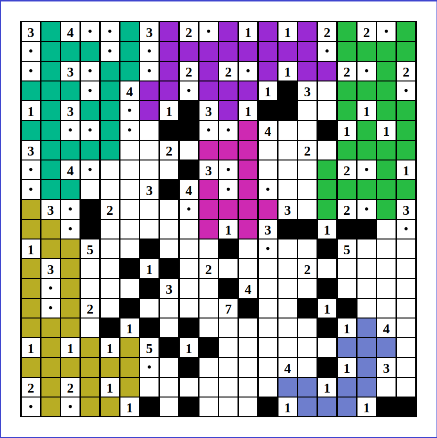

# Nurikabe-Assistant

A chrome extension to automate the boring stuffs when solving the Nurikabe puzzle.

# Requirement

- Google Chrome

# How to Use

1. Install this application as a Chrome extension. 

   In your Chrome browser settings, go to `More Tools > Extensions` and turn on `Developer mode`. Then, click `Load unpacked` and select the `src` directory of this repo. 

2. Try out some puzzles in the [Nurikabe Puzzle Site](https://www.puzzle-nurikabe.com/)!

# Features and Strategies

1. Streams Highlighting.

   
   
   Each connected streams have the same color. This helps you check which streams are not connected yet.

2. Unreachables. The unreachable cells from any island is a stream.

3. Lone Exit. If there is only one exit cell for an island or stream, it will exit through that cell.

4. Dot in the Corner. Since there cannot be a 2x2 stream, once 3 stream cells are found in a 2x2 window, the remaining white cell is part of an island.

5. Cover the Islands. If the island has been completed, the surrounding cells is a stream. 

6. Disconnect the Islands. Islands cannot be connected, so the cell which is a neighbor of two islands is a stream.
